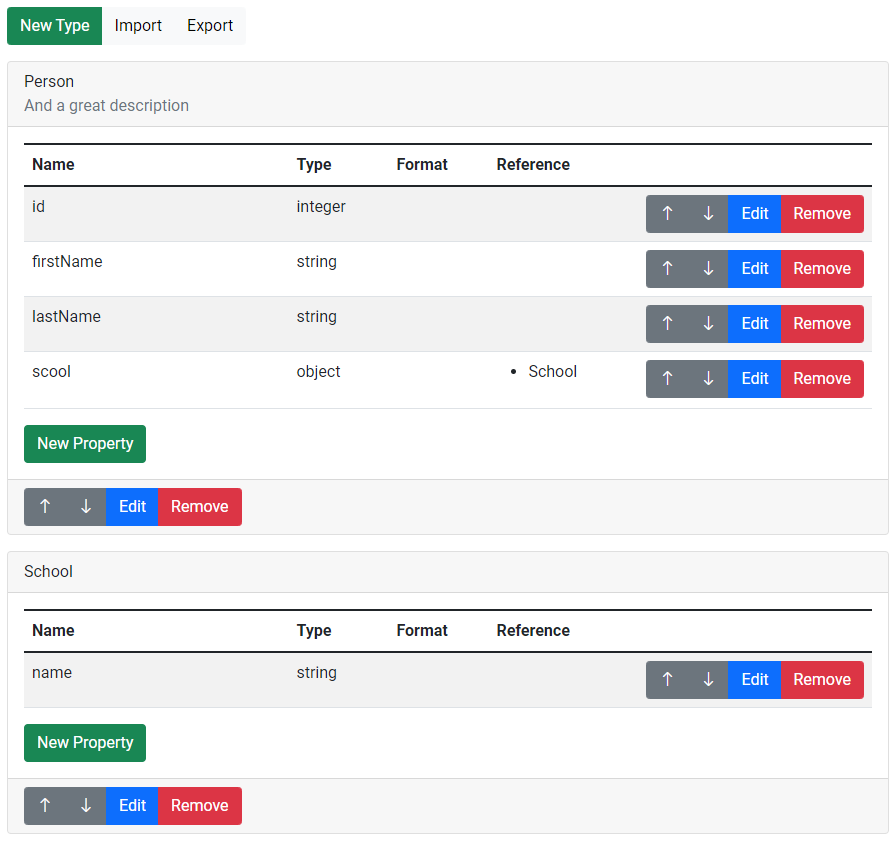

# TypeSchemaAngularEditor

This package provides an Angular Editor Component which provides a visual editor to design a
[TypeSchema](https://typeschema.org/) or [TypeAPI](https://typeapi.org) specification.
It also integrates with the [typehub.cloud](https://typehub.cloud/) API so that a user can integrate
remote schemas registered at the TypeHub cloud platform. The following screenshot shows an example
of the editor:



We use this component in different products:

* [Fusio](https://www.fusio-project.org/)
* [TypeHub](https://typehub.cloud/)
* [APIgen](https://apigen.app/)
* [SDKgen](https://sdkgen.app/)

## Usage

You can use the `typeschema-editor` component directly in your template

```angular2html
<typeschema-editor [specification]="spec" [importEnabled]="false" (save)="submit($event)" (change)="change($event)"></typeschema-editor>
```

In your controller you can then listen on the save or change event:

```typescript
export class DesignerComponent implements OnInit {

  spec: Specification = {
    imports: [],
    types: []
  };

  ngOnInit(): void {
  }

  submit(spec: Specification) {
    // is called everytime a user clicks on the save button
  }

  change(spec: Specification) {
    // is called everytime the user changes the schema through the editor
  }

}
```

## Input

### `specification`

The specification object

### `operationEnabled`

Default: false

Whether it is possible to manage operations

### `importEnabled`

Default: true

Whether it is possible to import specifications from remote sources

### `readonly`

Default: false

Whether the editor is readonly, if true the editor only renders the specification with no option to
modify the specification.

## Development

Internally the component does not work directly on a TypeSchema/TypeAPI JSON instead it uses
an internal representation. The `Specification` is the internal representation, if
you want to turn this into a TypeSchema you can use the `ExportService`
service. There is also an `ImportService` service which converts a specification into the
internal `Specification` representation.
