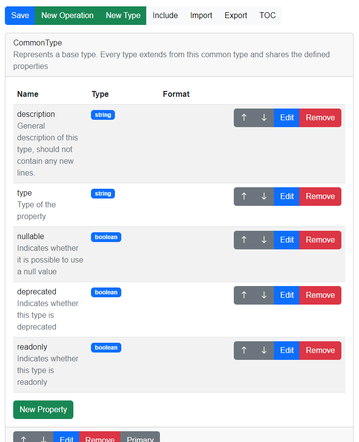

# TypeschemaAngularEditor

This package provides an Angular Editor Component which provides a visual
editor to design a TypeSchema. It also integrates with the [typehub.cloud](https://typehub.cloud/)
API so that a user can integrate remote schemas registered at the cloud.
The following screenshot shows an example of the editor:

We use this component in different products:

* [Fusio](https://www.fusio-project.org/)
* [APIgen](https://apigen.app/)
* [TypeHub](https://typehub.cloud/)
